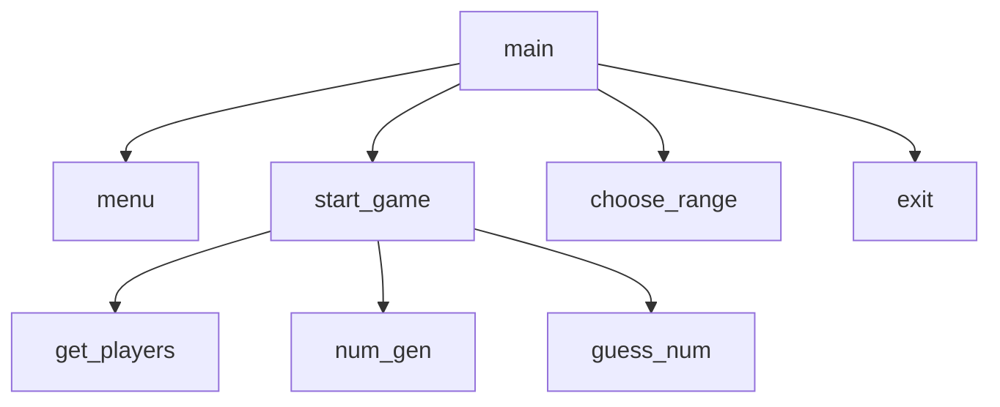

# Random Number Guessing Game
Tate Basham, Allen Le

## Random Number Guessing Game Description
Random Number Guessing Game (RNGG) is a guessing game which involves two players. The program will define a number defined in the scope of the range (can be customized). The players will take turns guessing the number. If the correct number is guessed, the player who guessed it will be congratulated and prompts to play again, change the range, or exit the game!

### Random Number Guessing Game Flowchart

#### Function Diagrams

| `main`    |               |  Allen Le     |
| ------------------ | ------------- | ------------ |
| `arguments:none`    | main accepts no arguements  |              |
|      | takes choice from menu() and finds the proper function to call  | outputs the correct function.         |
***
| `menu`    |               |     Allen Le   |
| ------------------ | ------------- | ------------ |
| `argument:none`    | menu accepts no arguements  |              |
| `choice:int`    | prompts the user for the choice number based on displayed options.    |              |
|      | | returns choice for main()             |
***
| `start_game()`    |               |     Allen Le   |
| ------------------ | ------------- | ------------ |
| `argument:none`    | takes input from the user for the choice  |              |
|      | prompts the user for the choice number based on displayed options.  | returns choice for main()             |
