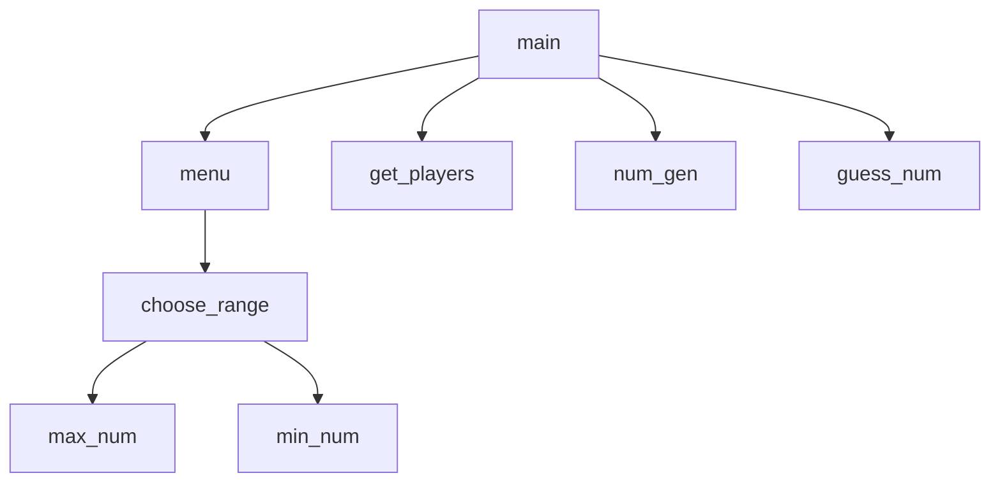

# Random Number Guessing Game
Tate Basham, Allen Le

## Random Number Guessing Game Description
Random Number Guessing Game (RNGG) is a guessing game which involves two players. The program will define a number defined in the scope of the range (can be customized). The players will take turns guessing the number. If the correct number is guessed, the player who guessed it will be congratulated and prompts to play again, change the range, or exit the game!

### Random Number Guessing Game Flowchart

#### Function Diagrams

| `main`    |               |  Allen Le     |
| ------------------ | ------------- | ------------ |
| `arguments:none`    | main accepts no arguements  |              |
|      | takes choice from menu() and finds the proper function to call  | outputs the correct function.         |
***
| `menu`    |               |     Allen Le   |
| ------------------ | ------------- | ------------ |
| `argument:none`    | menu accepts no arguements  |              |
| `choice:int`    | prompts the user for the choice number based on displayed options.    |              |
|      | | returns choice for main()             |
***
| `choose_range()`    |               |  Tate Basham   |
| ------------------ | ------------- | ------------ |
| `argument:none`    | choose range accepts no args  |              |
| `MIN_NUMBER:int`    | promots the user for the minimum number    |              |
| `MAX_NUMBER:int`    | promots the user for the maximum number    |              |
|      | | returns MIN_NUMBER and MAX_NUMBER           |
***
| `get_players()`    |               |     Tate Basham   |
| ------------------ | ------------- | ------------ |
| `argument:none`    | accepts no args  |              |
| `p1:str`     | prompts the user for the name of player 1  |   |
| `p2:str` | prompts the user for the name of player 2 | |
| | returns p1 and p2 | |
***
| `num_gen()`    |               |     Tate Basham   |
| ------------------ | ------------- | ------------ |
| `argument:int`    | accepts two args (MIN_NUMBER and MAX_NUMBER)  |              |
| `import random` | using random, it generates a random int from MIN_NUMBER and MAX_NUMBER | values from choose_range() |
| | returns `game_number` which is the request number | |
***
| `guess_num()`    |               |     Allen Le   |
| ------------------ | ------------- | ------------ |
| `argument:none`    | accepts `game_number` from num_gen()  |              |
| `int:guess` | the function prompts the user for their guess (int input) | |
| | checks the number with `game_number` | |
| | if `guess` > `game_number` then it will tell the user to guess a number lower than `guess` | |
| | if `guess` < `game_number` then it will tell the user to guess a number higher than `guess` | |
| | if `guess` = `game_number` then it will congratulate the user and prompt them back to the menu | |
